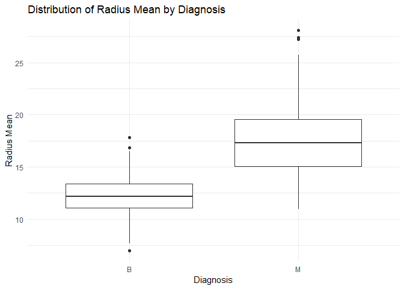

summarizeTumor Package Documentation
================
Poorna Murali
2024-11-08

- [1 Introduction](#1-introduction)
- [2 Installation](#2-installation)
- [3 Examples](#3-examples)
- [4 License](#4-license)

# 1 Introduction

**`summarizeTumor`Package Description**

The `summarizeTumor` package provides a set of functions designed to
help users summarize cancer-related tumor data. Specifically, it
calculates statistical summaries (e.g., mean, median, standard
deviation) for numeric columns within a cancer dataset, grouped by tumor
type (diagnosis). This package is particularly useful for gaining
insights into the distribution of tumor-related metrics and facilitates
data pre-processing and analysis.

**Key Functionality**

The main function, summarize_tumor_data(), allows users to summarize
numeric columns (e.g., radius_mean, texture_mean) in the dataset by
different tumor types or diagnoses. The function supports flexibility in
output, allowing for customized aggregation and data grouping.

# 2 Installation

To install the summarizeTumor package from GitHub, you’ll need to use
the devtools package. Here’s how to do it:

``` r
# Install devtools if not already installed
install.packages("devtools")
#> Error in install.packages : Updating loaded packages
devtools::install_github("https://github.com/stat545ubc-2024/summarizeTumor.git")
#> Using GitHub PAT from the git credential store.
#> Skipping install of 'summarizeTumor' from a github remote, the SHA1 (5e79353c) has not changed since last install.
#>   Use `force = TRUE` to force installation
```

**Demonstrated Usage**

Once installed, you can start using the `summarize_tumor_data()`
function as shown below. The function’s parameters include:

`data`: A data frame or tibble containing the tumor data (e.g., the
cancer dataset with columns like `radius_mean`, `texture_mean`).
`group_col`: The column to group by when summarizing the data (e.g.,
`diagnosis`, which indicates whether the tumor is benign or malignant).
`column_to_summarize`: The numeric column to calculate statistics for
(e.g., `radius_mean`, `texture_mean`).

# 3 Examples

Each row represents a sample with features such as `radius_mean`,
`texture_mean`, `perimeter_mean`, etc., and a column `diagnosis`
representing the tumor type (benign or malignant).

**Basic Usage**

Summarize the radius_mean in the cancer_sample dataset, grouped by
diagnosis (benign or malignant):

``` r
library(summarizeTumor)
library(dplyr)
# Load the cancer_sample dataset
data("cancer_sample", package = "datateachr")

# Summarize the 'radius_mean' column by diagnosis
tumor_summary <- summarize_tumor_data(cancer_sample, "radius_mean")
#> Data summarized successfully for column: radius_mean

# Print the summarized data
print(tumor_summary)
#> # A tibble: 2 × 4
#>   diagnosis  mean median    sd
#>   <chr>     <dbl>  <dbl> <dbl>
#> 1 B          12.1   12.2  1.78
#> 2 M          17.5   17.3  3.20
```

**Plotting**

You can also visualize the distribution of the radius_mean values for
each diagnosis group using a boxplot.



This plot shows the distribution of `radius_mean` values for benign and
malignant tumor samples in the dataset. The boxplot allows you to
visually compare the central tendency and spread of the radius_mean
variable across different diagnosis categories.

# 4 License

This package is licensed under the MIT License.
